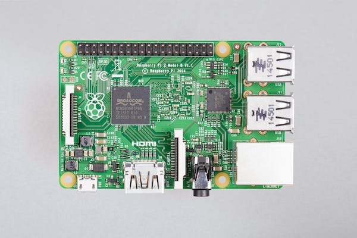

# Deep Learning and Machine Vision, Camera and Lens Guide

## Intro

Imagine that you were tasked with designing a machine vision system that will deploy deep learning techniques to capture defects in the manufacturing environment. Additionally, for the manufacturing setup, we can imagine printed circuit board assembly (PCBA) fab that needs to capture defects like missing components (resistors, capacitors, etc.), skewed components, flipped components, wrong orientation of the componets, and many more in surface mount technology (SMT) footprint.

## System requirements

Assuming the fab is capable of assemblying the components as small as 0603 (metric), which is equivalent to a rectngular shape with 0.6 x 0.3 mm size, we can take 0.3 mm as being the smallest defect that needs to be captured.
In addition, we can assume the largest PCBA is 85 x 56 mm (RPi2) below, and it comes under the field-of-view (FOV) of the camera on a conveyor belt that is 100 mm wide moving at the speed of 100 mm/s. Since the board can be anywhere on the coveyor belt, our system's overall FOV is 100 x 85 mm. That is, 100 mm  for the width of the conveyor, and 85 mm for the RPi2's length.

[Image 1 source](https://images.prismic.io/rpf-products/5d56c54b-59a5-4d9c-8c01-6caf6d43772c_pi2%20B%20Top%20Down.jpg?ixlib=gatsbyFP&auto=compress%2Cformat&fit=max&w=600&h=400)

## Camera Resolution

