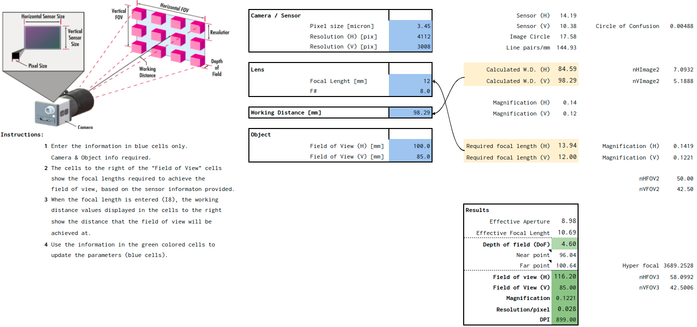

# Deep Learning and Machine Vision, Camera and Lens Guide

## Intro

Imagine that you were tasked with designing a machine vision system that will deploy deep learning techniques to capture defects in the manufacturing environment. Additionally, for the manufacturing setup, we can imagine printed circuit board assembly (PCBA) fab that needs to capture defects like missing components (resistors, capacitors, etc.), skewed components, flipped components, wrong orientation of the componets, and many more in surface mount technology (SMT) footprint.

## System Requirements

Assuming the fab is capable of assemblying the components as small as 0603 (metric), which is equivalent to a rectngular shape with 0.6 x 0.3 mm size, we can take 0.3 mm as being the smallest defect that needs to be captured.
In addition, we can assume the largest PCBA is 85 x 56 mm (RPi2) below, and it comes under the field-of-view (FOV) of the camera on a conveyor belt that is 100 mm wide moving at the speed of 100 mm/s. Since the board can be anywhere on the coveyor belt, our system's overall FOV is 100 x 85 mm. That is, 100 mm  for the width of the conveyor, and 85 mm for the RPi2's length.

[Image 1 source](https://images.prismic.io/rpf-products/5d56c54b-59a5-4d9c-8c01-6caf6d43772c_pi2%20B%20Top%20Down.jpg?ixlib=gatsbyFP&auto=compress%2Cformat&fit=max&w=600&h=400)

## Camera Resolution

Given the above information, we are now able to calculate the minimum camera resolution needed to capture the smallest defect in the given FOV.
To make these calculations, use [Camera and Lens guide.](https://docs.google.com/spreadsheets/d/1Z2F2R_iJZvdFtYngHKgEF5hhIu-o1xkFQkvjp5klu40/edit?usp=sharing)

Based on our calculations, we need a 9.44 MP camera in order to capture 0603 size defective component on a PCBA.

## Camera Selection

When we talk about camera resolution, what we really mean is the imaging sensor resolution. There are many camera manufacturers, and only a handful of imaging sensor manufacturers; Sony being among the most popular one.
Here is a short list of popular Sony imaging sensors, and some specs:

|Product|Resolution|Pixels HxV|Pixel size microns|
|:----|:----|:----|:----|
| | | | |
|IMX661-AAMR/AAQR|127 M|13472 x 9568|3.45|
|IMX342LLA/LQA|31.4 M|6480 x 4860|3.45|
|IMX530-AAMJ/AAQJ|24.5 M|5328 x 4608|2.74|
|IMX540-AAMJ/AAQJ|24.5 M|5328 x 4608|2.74|
|IMX531-AAMJ/AAQJ|20.3 M|4512 x 4512|2.74|
|IMX541-AAMJ/AAQJ|20.3 M|4512 x 4512|2.74|
|IMX367LLA/LQA|19.6 M|4432 x 4436|3.45|
|IMX387LLA/LQA|16.8 M|5472 x 3084|3.45|
|IMX532-AAMJ/AAQJ|16.1 M|5328 x 3040|2.74|
|IMX542-AAMJ/AAQJ|16.1 M|5328 x 3040|2.74|
|IMX535-AAMJ/AAQJ|12.4 M|4128 x 3008|2.74|
|IMX545-AAMJ/AAQJ|12.4 M|4128 x 3008|2.74|
|IMX565-AAMJ/AAQJ|12.4 M|4128 x 3008|2.74|
|IMX304LLR/LQR|12.3 M|4112 x 3008|3.45|
|IMX253LLR/LQR|12.3 M|4112 x 3008|3.45|
|IMX267LLR/LQR|8.9 M|4112 x 2176|3.45|
|IMX255LLR/LQR|8.9 M|4112 x 2176|3.45|
|IMX487-AAMJ|8.1 M|2856 x 2848|2.74|
|IMX536-AAMJ/AAQJ|8.1 M|2856 x 2848|2.74|
|IMX546-AAMJ/AAQJ|8.1 M|2856 x 2848|2.74|
|IMX566-AAMJ/AAQJ|8.1 M|2856 x 2848|2.74|
|IMX428LLJ/LQJ|7.1 M|3216 x 2208|4.5|
|IMX420LLJ/LQJ|7.1 M|3216 x 2208|4.5|
|IMX537-AAMJ/AAQJ|5.1 M|2472 x 2064|2.74|
|IMX547-AAMJ/AAQJ|5.1 M|2472 x 2064|2.74|
|IMX548-AAMJ/AAQJ|5.1 M|2472 x 2064|2.74|
|IMX567-AAMJ/AAQJ|5.1 M|2472 x 2064|2.74|
|IMX568-AAMJ/AAQJ|5.1 M|2472 x 2064|2.74|
|IMX250LLR/LQR|5.0 M|2464 x 2056|3.45|
|IMX264LLR/LQR|5.0 M|2464 x 2056|3.45|
|IMX265LLR/LQR|3.1 M|2064 x 1544|3.45|
|IMX252LLR/LQR|3.1 M|2064 x 1544|3.45|
|IMX437LQJ|2.8 M|1944 x 1472|4.5|
|IMX429LLJ/LQJ|2.8 M|1944 x 1472|4.5|
|IMX421LLJ/LQJ|2.8 M|1944 x 1472|4.5|
|IMX392LLR/LQR|2.3 M|1936 x 1216|3.45|
|IMX174LLJ/LQJ|2.3 M|1936 x 1216|5.86|
|IMX302LQJ|2.3 M|1936 x 1216|5.86|
|IMX249LLJ/LQJ|2.3 M|1936 x 1216|5.86|
|IMX430LLJ/LQJ|2.0 M|1632 x 1248|4.5|
|IMX422LLJ/LQJ|2.0 M|1632 x 1248|4.5|
|IMX432LLJ/LQJ|1.7 M|1608 x 1104|9|
|IMX425LLJ/LQJ|1.7 M|1608 x 1104|9|
|IMX296LLR/LQR|1.5 M|1456 x 1088|3.45|
|IMX273LLR/LQR|1.5 M|1456 x 1088|3.45|
|IMX433LLJ/LQJ|0.5 M|816 x 624|9|
|IMX426LLJ/LQJ|0.5 M|816 x 624|9|
|IMX297LLR/LQR|0.4 M|728 x 544|6.9|
|IMX287LLR/LQR|0.4 M|728 x 544|6.9|
|IMX397CLN|0.3 M|656 x 496|3.45|
|IMX250MZR/MYR|5.0 M|2464 x 2056|3.45|
|IMX253MZR/MYR|12.3 M|4112 x 3008|3.45|
|IMX264MZR/MYR|5.0 M|2464 x 2056|3.45|
|IMX411ALR/AQR|151 M|14208 x 10656|3.76|
|IMX461ALR/AQR|102 M|11664 x 8750|3.76|
|IMX455ALK-K|61.1 M|9576 x 6388|3.76|
|IMX492LLJ/LQJ|47.0 M|8336 x 5648|2.315|
|IMX571BLR-J|26.1 M|6252 x 4176|3.76|
|IMX183CLK-J/CQJ-J|20.4 M|5544 x 3694|2.4|
|IMX226CLJ|12.4 M|4072 x 3046|1.85|
|IMX533CLK|9.0 M|3011 x 3011|3.76|
|IMX335LLN|5.1 M|2616 x 1964|2|
|IMX424|7.42M| |2.25|
|IMX490|5.40M| |3|
|IMX390CPV|2.45M| |3|
|IMX390CQV|2.45M| |3|
|IMX290NQV|2.13M| |2.9|
|IMX224|1.27M| |3.75|
|ISX019|1.23M| |2.9|
|ISX016|1.26M| |2.8|

Since we need a sensor of at least 9.44 MP, IMX253LLR/LQR from the above list looks likea good candidate. There are many camera manufacturers that use Sony sensors, and some of the well known ones are TeledyneDalsa, AlliedVision, IDS Imaging, JAI, etc. Some of them might have a camera that incroporates this particular imaging sensor.

## Lens Calculations

Once we know the pixel size of the sensor as well as number of pixels in horizontal and vertical directions, we can calculate most lens parameters using
[Camera and Lens guide.](https://docs.google.com/spreadsheets/d/1Z2F2R_iJZvdFtYngHKgEF5hhIu-o1xkFQkvjp5klu40/edit?usp=sharing).
In our example, it looks like this:

## Lens Selection

There are many lens manufacturers, and below is the list of some of the most popular ones together with some lens models and their specifications. One common denominator for the lenses in the table below is that they are all C mount type, hence they will only work with C mount cameras, which is the most common mounting in the machine vision industry.

|OEM|PN|Focal length [mm]|Resolution [MP]|Resolving power [lp / mm]|F. no|WD [mm]|Angle of View|Mount|Weight [g]|Sensor size [inches]|Pixel size [microns]|Dimensions [mm]|TV distortion [%]|Filter thread [mm]|
|:----|:----|:----|:----|:----|:----|:----|:----|:----|:----|:----|:----|:----|:----|:----|
| | | | | | | | | | | | | | | |
|Fujinon|CF8ZA-1S|8|23|n/a|F1.8 - F16|100 +|85.7 x 67.5|C|180|1.1|2.5|d54 x 67|-4.81|M52 x 0.75|
|Fujinon|CF12ZA-1S|12|23|n/a|F1.8 - F16|100 +|62.5 x 47.8|C|180|1.1|2.5|d39 x 67.6|-2.82|M37.5 x 0.5|
|Fujinon|CF16ZA-1S|16|23|n/a|F1.8 - F16|100 +|47.3 x 36.1|C|180|1.1|2.5|d39 x 67.6|-0.8|M37.5 x 0.5|
|Fujinon|CF25ZA-1S|25|23|n/a|F1.8 - F16|100+|32.9 x 24.8|C|170|1.1|2.5|d39 x 67.3|-0.83|M37.5 x 0.5|
|Fujinon|CF35ZA-1S|35|23|n/a|F1.8 - F16|200+|23 x 17.3|C|165|1.1|2.5|d39 x 67.3|-0.32|M37.5 x 0.5|
|Fujinon|CF50ZA-1S|50|23|n/a|F2.4 - F16|200+|16.6 x 12.5|C|155|1.1|2.5|d39 x 68|-0.17|M37.5 x 0.5|
|Fujinon|HF818-12M|8|12|n/a|F1.8 - F22|100+|56.9 x 43.9|C|95|2/3|2.1|d33 x 48.5|-1.03|M30.5 x 0.5|
|Fujinon|HF1218-12M|12|12|n/a|F1.8 - F22|100+|39.3 x 30.0|C|85|2/3|2.1|d33 x 52.5|0.18|M30.5 x 0.5|
|Fujinon|HF1618-12M|16|12|n/a|F1.8 - F22|100+|30.8 x 23.3|C|90|2/3|2.1|d33 x 52.5|-0.03|M30.5 x 0.5|
|Fujinon|HF2518-12M|25|12|n/a|F1.8 - F22|100+|20.0 x 15.1|C|85|2/3|2.1|d33 x 53.1|0.02|M30.5 x 0.5|
|Fujinon|HF3518-12M|35|12|n/a|F2.0 - F22|200+|14.7 x 11.0|C|85|2/3|2.1|d33 x 53.1|0.01|M30.5 x 0.5|
|Fujinon|HF6XA-5M|6|5|n/a|F1.9 - F16|100+|74.7 x 58.1|C|100|2/3|3.45|d39 x 51|-2.88|M37.5 x 0.5|
|Fujinon|HF8XA-5M|8|5|n/a|F1.6 - F16|100+|58.4 x 44.6|C|79|2/3|3.45|d29.5 x 51.5|-1.99|M25.5 x 0.5|
|Fujinon|HF12XA-5M|12|5|n/a|F1.6 - F16|100+|40.1 x 30.3|C|79|2/3|3.45|d29.5 x 51.5|-1.26|M25.5 x 0.5|
|Fujinon|HF16XA-5M|16|5|n/a|F1.6 - F16|100+|31.4 x 23.7|C|71|2/3|3.45|d29.5 x 46.0|-0.6|M25.5 x 0.5|
|Fujinon|HF25XA-5M|25|5|n/a|F1.6 - F16|100+|20.0 x 15.0|C|72|2/3|3.45|d29.5 x 46.5|-0.07|M25.5 x 0.5|
|Fujinon|HF35XA-5M|35|5|n/a|F1.9 - F16|200+|14.2 x 10.7|C|60|2/3|3.45|d29.5 x 41.5|0.1|M25.5 x 0.5|
|Fujinon|HF50XA-5M|50|5|n/a|F2.4 - F16|200+|10.4 x 7.8|C|95|2/3|3.45|d33.0 x 66.5|0.01|M30.5 x 0.5|
|Fujinon|HF12.5SA-1|12.5|5|n/a|F1.4 - F22|100+|38.0 x 29.0|C|295|2/3|3.45|d51 x 68.5|-0.08|M49 x 0.75|
|Fujinon|HF16SA-1|16|5|n/a|F1.4 - F22|100+|30.2 x 22.9|C|285|2/3|3.45|d51 x 70.5|0.11|M49 x 0.75|
|Fujinon|HF25SA-1|25|5|n/a|F1.4 - F22|100+|20.8 x 15.7|C|315|2/3|3.45|d51 x 75.5|-0.06|M49 x 0.75|
|Fujinon|HF35SA-1|35|5|n/a|F1.4 - F22|200+|14.0 x 10.5|C|185|2/3|3.45|d51 x 48.5|0.07|M49 x 0.75|
|Fujinon|HF50SA-1|50|5|n/a|F1.8 - F22|400+|9.7 x 7.3|C|240|2/3|3.45|d51 x 55.5|0.08|M49 x 0.75|
|Fujinon|HF75SA-1|75|5|n/a|F1.8 - F22|900+|6.7 x 5.0|C|305|2/3|3.45|d51 x 76.0|0.01|M49 x 0.75|
|Moritex|ML-U0817SR-18C|8|12|150|F1.7 - F16|100+|86.4 x 69.53|C|244|1.1|3.5|d58 x 82.5|-2.151|M55 x 0.75|
|Moritex|ML-U1217SR-18C|12|12|150|F1.7 - F16|100+|58.80 x 45.11|C|200|1.1|3.5|d39.5 x 69.5|-2.136|M35.5 x 0.5|
|Moritex|ML-U1615SR-18C|16|12|150|F1.5 - F16|100+|45.12 x 34.70|C|182|1.1|3.5|d39.5 x 71.0|-0.833|M35.5 x 0.5|
|Moritex|ML-U2515SR-18C|25|12|150|F1.5 - F16|100+|31.33 x 23.61|C|210|1.1|3.5|d42.0 x 71.0|-0.324|M37 x 0.75|
|Moritex|ML-U3518SR-18C|35|12|150|F1.8 - F16|200+|18.4 x 14.04|C|120|1.1|3.5|d39.5 x 50.0|-0.169|M35.5 x 0.5|
|Moritex|ML-U5022SR-18C|50|12|150|F2.2 - F16|300+|12.07 x 9.01|C|140|1.1|3.5|d39.5 x 64.9|-0.057|M35.5 x 0.5|
|Moritex|ML-M0625UR|6|n/a|200|F2.5 - F16|100+|74.27 x 57.92|C|90|2/3|2.2|d29 x 51.8|-2.783|n/a|
|Moritex|ML-M0822UR|8|n/a|200|F2.2 - F16|100+|59.15 x 45.46|C|60|2/3|2.2|d29 x 44.2|-1.846|M25.5 x 0.5|
|Moritex|ML-M1218UR|12|n/a|200|F1.8 - F16|150+|39.40 x 30.05|C|60|2/3|2.2|d29 x 45.5|-0.905|M25.5 x 0.5|
|Moritex|ML-M1616UR|16|n/a|200|F1.6 - F16|150+|29.62 x 22.39|C|50|2/3|2.2|d29 x 39.5|-0.674|M25.5 x 0.5|
|Moritex|ML-M2516UR|25|n/a|200|F1.6 - F16|150+|18.05 x 13.89|C|50|2/3|2.2|d29 x 42.5|-0.271|M25.5 x 0.5|
|Moritex|ML-M3520UR|35|n/a|200|F2.0 - F16|200+|12.62 x 9.76|C|50|2/3|2.2|d29 x 42.2|-0.142|M25.5 x 0.5|
|Moritex|ML-M5025UR|50|n/a|200|F2.5 - F16|300+|7.91 x 5.93|C|70|2/3|2.2|d29.5 x 63.4|-0.021|M25.5 x 0.5|
|Moritex|ML-M0818HR|8|n/a|130|F1.8 - F16|100+|58.20 x 44.82|C|50|2/3|4.5|d29 x 40.0|-1.497|M25.5 x 0.5|
|Moritex|ML-M1218HR|12|n/a|130|F1.8 - F16|150+|39.16 x 29.91|C|50|2/3|4.5|d29 x 38.0|-0.459|M25.5 x 0.5|
|Moritex|ML-M1618HR|16|n/a|130|F1.8 - F16|200+|29.67 x 22.43|C|50|2/3|4.5|d29 x 37.0|-0.141|M25.5 x 0.5|
|Moritex|ML-M2518HR|25|n/a|130|F1.8 - F16|200+|17.62 x 13.18|C|40|2/3|4.5|d29 x 37.0|-0.07|M25.5 x 0.5|
|Moritex|ML-M3520HR|35|n/a|130|F2.0 - F16|250+|11.94 x 9.04|C|40|2/3|4.5|d29 x 39.8|0.043|M25.5 x 0.5|
|Moritex|ML-M5025HR|50|n/a|130|F2.5 - F16|300+|7.99 x 5.94|C|60|2/3|4.5|d29 x 55.7|0.034|M25.5 x 0.5|
|Kowa|LM8JC10M|8|10|200|F1.8 - F22|100+|54.0 x 41.9|C|115|2/3|2.5|d36 x 56|0.31|M34 x 0.5|
|Kowa|LM12JC10M|12|10|200|F1.8 - F11|100+|39.1 x 29.8|C|105|2/3|2.5|d27 x 53.5|-0.12|M25.5 x 0.5|
|Kowa|LM16JC10M|16|10|200|F1.8 - F16|100+|30.0 x 22.7|C|90|2/3|2.5|d27 x 47.5|-0.2|M25.5 x 0.5|
|Kowa|LM25JC10M|25|10|200|F1.8 - F16|100+|20.0 x 15.1|C|95|2/3|2.5|d27 x 51.2|-0.09|M25.5 x 0.5|
|Kowa|LM35JC10M|35|10|200|F2.0 - F16|100+|14.3 x 10.8|C|160|2/3|2.5|d43 x 49|0.05|M34 x 0.5|
|Kowa|LM50JC10M|50|10|200|F2.8 - F16|100+|19.1 x 14.3|C|170|2/3|2.5|d38 x 77|-0.02|M30.5 x 0.5|
|Kowa|LM8JC5MC|8|5|160|F2.8 - F16|150+|57.6 x 44.4|C|55|2/3|3.5|d32 x 27|-0.85|M30.5 x 0.5|
|Kowa|LM12JC5MC|12|5|160|F2.8 - F16|200+|41.0 x 31.2|C|55|2/3|3.5|d32 x 26.8|-0.43|n/a|
|Kowa|LM16JC5MC|16|5|160|F2.8 - F16|200+|30.9 x 23.4|C|55|2/3|3.5|d32 x 26.5|-0.09|n/a|
|Kowa|LM25JC5MC|25|5|160|F2.8 - F16|200+|20.0 x 15.0|C|55|2/3|3.5|d32 x 25|0.06|n/a|
|Kowa|LM35JC5MC|35|5|160|F2.8 - F16|200+|14.0 x 10.6|C|50|2/3|3.5|d32 x 27.9|-0.02|M30.5 x 0.5|
|Kowa|LM50JC5MC|50|5|160|F2.8 - F16|300+|10.0 x 7.5|C|60|2/3|3.5|d32 x 34.7|-0.01|M30.5 x 0.5|
|Kowa|LM12JC5M2|12|5|160|F1.4 - F16|100+|38.4 x 29.2|C|130|2/3|3.5|d38.5 x 55.7|-0.06|M30.5 x 0.5|
|Kowa|LM16JC5M2|16|5|160|F1.4 - F16|100+|29.9 x 22.7|C|125|2/3|3.5|d38.5 x 57.4|0.03|M30.5 x 0.5|
|Kowa|LM25JC5M2|25|5|160|F1.6 - F16|100+|19.9 x 15.0|C|115|2/3|3.5|d38.5 x 54.4|-0.01|M30.5 x 0.5|
|Kowa|LM35JC5M2|35|5|160|F1.6 - F16|180+|14.3 x 10.8|C|120|2/3|3.5|d38.5 x 58.6|-0.03|M30.5 x 0.5|
|Kowa|LM8XC|8|20|160|F2.8 - F22|100+|93.5 x 77.1|C|245|4/3|3|d74.0 x 82.5|0.12|M72 x 0.75|
|Kowa|LM12XC|12|20|160|F2.0 - F22|100+|74.9 x 59.6|C|270|4/3|3|d57.0 x 85.0|0.598|M55 x 0.75|
|Kowa|LM16XC|16|20|160|F2.0 - F22|100+|60.6 x 47.2|C|250|4/3|3|d45 x 79.5|0.02|M40.5 x 0.5|
|Kowa|LM25XC|25|20|160|F2.0 - F16|150+|40.9 x 31.1|C|255|4/3|3|d45 x 89.0|-0.57|M40.5 x 0.5|
|Kowa|LM35XC|35|20|160|F2.0 - F16|200+|29.6 x 22.4|C|210|4/3|3|d45 x 74.0|-0.17|M37.5 x 05|
|Kowa|LM50XC|50|20|160|F2.0 - F22|300+|20.6 x 15.7|C|235|4/3|3|d47 x 78.0|0.8|M37.5 x 05|
|Kowa|LM8FC24M|8|24|200|F2.5 - F16|100+|79.2 x 63.8|C|230|1.1|2.5|d64 x 73.3|0.55|M62 x 0.75|
|Kowa|LM12FC24M|12|24|200|F1.8 - F16|100+|60.0 x 46.9|C|260|1.1|2.5|d51 x 73.8|0.26|M49 x 0.75|
|Kowa|LM16FC24M|16|24|200|F1.8 - F16|100+|48.0 x 36.7|C|200|1.1|2.5|d43 x 65.7|0.4|M35.5 x 0.5|
|Kowa|LM25FC24M|25|24|200|F1.8 - F16|100+|31.5 x 23.9|C|220|1.1|2.5|d45 x 69.4|-0.3|M35.5 x 0.5|
|Kowa|LM35FC24M|35|24|200|F1.8 - F16|200+|22.1 x 16.7|C|205|1.1|2.5|d45 x 66.0|0.01|M40.5 x 0.5|
|Kowa|LM50FC24M|50|24|200|F1.8 - F16|200+|16.1 x 12.1|C|205|1.1|2.5|d45 x 74.5|-0.03|M40.5 x 0.5|
|Tamron|MA111F16VIR|16|24|n/a|F2.8 - F16|100+|47.7 x 36.8|C|178|1.1|2.5|d43 x 71.1|0.2|M40.5 x 0.5|
|Tamron|MA111F25VIR|25|24|n/a|F2.8 - F16|100+|31.7 x 23.9|C|196|1.1|2.5|d43 X 51.6|-0.3|M40.5 x 0.5|
|Tamron|MA111F35VIR|35|24|n/a|F2.8 - F16|200+|22.8 X 17.2|C|179|1.1|2.5|d43 x 71.2|0.3|M40.5 x 0.5|
|Tamron|MA111F50VIR|50|24|n/a|F2.8 - F16|200+|16.0 X 12.0|C|181|1.1|2.5|d43 x 73.5|0.1|M40.5 x 0.5|
|Tamron|M112FM08|8|5|n/a|F2.4 - F16|100+|70.3 x 54.9|C|86|1/1.2 [2/3]|5.86 [3.45]|d29 x 46.3|-1.47|M35.5 x 0.5|
|Tamron|M112FM12|12|5|n/a|F2.0 - F16|100+|49.2 x 37.6|C|64|1/1.2 [2/3]|5.86 [3.45]|d29 x 42.5|-0.97|M27 x 0.5|
|Tamron|M112FM16|16|5|n/a|F2.0 - F16|100+|37.4 28.4|C|51|1/1.2 [2/3]|5.86 [3.45]|d29 x 35.2|-0.56|M27 x 0.5|
|Tamron|M112FM25|25|5|n/a|F1.8 - F16|100+|24.1 x 18.2|C|54|1/1.2 [2/3]|5.86 [3.45]|d29 x 41.0|-0.09|M27 x 0.5|
|Tamron|M112FM35|35|5|n/a|F2.1 - F16|200+|17.3 13.1|C|57|1/1.2 [2/3]|5.86 [3.45]|d29 x 43.1|0.05|M27 x 0.5|
|Tamron|M112FM50|50|5|n/a|F2.8 - F16|300+|12.2 x 9.2|C|70|1/1.2 [2/3]|5.86 [3.45]|d29 x 55.7|0.08|M27 x 0.5|
|Tamron|MA23F08V|8|8|n/a|F2.4 - F16|100+|58.9 x 45.5|C|84|2/3|2.74|d36 x 44.6|-0.6|M34 x 0.5|
|Tamron|MA23F25V|25|8|n/a|F2.4 - F16|100+|18.9 x 14.3|C|55|2/3|2.74|d29 x 41.3|-0.01|M27 x 0.5|
|Tamron|MA23F35V|35|8|n/a|F2.4 - F16|200+|12.5 x 9.4|C|58|2/3|2.74|d29 x 43.1|0.04|M27 x 0.5|
|Tamron|M117FM08|8|6|n/a|F2.4 - F16|100+|52.2 x 39.5|C|48|1/1.7|2.4|d32.5 x 34.9|-0.85|M30.5 x 0.5|
|Tamron|M117FM12|12|6|n/a|F2.4 - F16|100+|34.3 x 25.9|C|40|1/1.7|2.4|d29 x 31.8|-0.42|M27 x 0.5|
|Tamron|M117FM16|16|6|n/a|F2.4 - F16|100+|26.1 x 19.7|C|40|1/1.7|2.4|d29 x 34.8|-0.1|M27 x 0.5|
|Tamron|M117FM25|25|6|n/a|F2.4 - F16|100+|17.4 x 13.1|C|45|1/1.7|2.4|d29 x 40.0|-0.1|M27 x 0.5|
|Tamron|M117FM35|35|6|n/a|F2.4 - F16|100+|12.6 x 9.5|C|65|1/1.7|2.4|d29 x 50.0|-0.06|M27 x 0.5|
|Tamron|M117FM50|50|6|n/a|F2.8 - F16|200+|8.9 x 6.7|C|60|1/1.7|2.4|d29 x 49.3|-0.01|M27 x 0.5|
|Computar|V0828-MPY2|8|12|n/a|F2.8 - F16|200+|83.0 x 66.0|C|157.4|1.1|3.45|d57.5 x 53.2|-0.6|n/a|
|Computar|V1228-MPY2|12|12|n/a|F2.8 - F16|300+|60.5 x 46.2|C|97.2|1.1|3.45|d42 x 36.1|-0.5|M40.5 x 0.5|
|Computar|V1628-MPY2|16|12|n/a|F2.8 - F16|300+|48.2 x 36.2|C|89.8|1.1|3.45|d39.5 x 35.2|-0.5|M34 x 0.5|
|Computar|V2528-MPY2|25|12|n/a|F2.8 - F16|300+|31.7 x 23.5|C|78.6|1.1|3.45|d39.5 x 34|0.3|M34 x 0.5|
|Computar|V3528-MPY2|35|12|n/a|F2.8 - F16|300+|22.9 x 16.9|C|103|1.1|3.45|d39.5 x 45.2|-0.1|M34 x 0.5|
|Computar|V5028-MPY2|50|12|n/a|F2.8 - F16|500+|16.2 x 11.9|C|107|1.1|3.45|d39.5 x 45.2|0.1|M34 x 0.5|
|Computar|V0826-MPZ|8|20|n/a|F2.6 - F16|100+|76.9 x 61.5|C|203.1|1|2.4|d69.5 x 52.93|-0.8|M82 x 0.75|
|Computar|V1226-MPZ|12|20|n/a|F2.6 - F16|100+|56.7 x 44.1|C|98.4|1|2.4|d39 x 43.5|0|M37.5 x 0.5|
|Computar|V1624-MPZ|16|20|n/a|F2.4 - F16|100+|43.8 x 33.6|C|108.1|1|2.4|d39.5 x 47.0|0|M35.5 x 0.5|
|Computar|V2520-MPZ|25|20|n/a|F2.0 - F16|150+|28.8 x 21.8|C|73.1|1|2.4|d37.5 x 35.7|0|M35.5 x 0.5|
|Computar|V3522-MPZ|35|20|n/a|F2.2 - F16|200+|20.8 x 15.7|C|118.2|1|2.4|d39.5 x 55.7|0|M34 x 0.5|
|Computar|V5024-MPZ|50|20|n/a|F2.4 - F16|200+|14.6 x 11.0|C|138.5|1|2.4|d42 x 60.1|0|M30.5 x 0.5|
|Computar|M0828-MPW3|8|6|n/a|F2.8 - F16|100+|57.0 x 44.2|C|58|2/3|2.74|d32 x 35.5|-1.8|M30.5 x 0.5|
|Computar|M1228-MPW3|12|6|n/a|F2.8 - F16|100+|40.3 x 30.8|C|60|2/3|2.74|d29 x 43.5|-0.1|M27 x 0.5|
|Computar|M1628-MPW3|16|6|n/a|F2.8 - F16|250+|30.7 x 23.3|C|37|2/3|2.74|d29 x 29.0|0.47|M27 x 0.5|
|Computar|M3528-MPW3|35|6|na|F2.8 - F16|250+|14.3 x 10.8|C|48|2/3|2.74|d29 x 38.5|0.06|M27 x 0.5|
|Computar|F1228-MPT|12|45|n/a|F2.8 - F16|150+|60.4 x 43.4|C|205|1.4|2.3|d56.5 x 68.4|0.13|M72 x 0.75|
|Computar|F1628-MPT|16|45|n/a|F2.8 - F16|150+|60.4 x 43.4|C|187|1.4|2.3|d44.5 x 68.4|0.06|M52 x 0.75|
|Computar|F2524-MPT|25|45|n/a|F2.4 - F16|150+|41.9 x 29.3|C|152|1.4|2.3|d39 x 69.8|0.06|M34 x 0.5|
|Computar|F3526-MPT|35|45|n/a|F2.6 - F16|150+|30.6 x 21.1|C|122|1.4|2.3|d39 x 61.8|0.01|M34 x 0.5|
|Computar|F5026-MPT|50|45|n/a|F2.6 - F16|250+|21.7 x 14.9|C|151|1.4|2.3|d41 x 75.3|-0.03|M30.5 x 0.5|
|Schneider Kreuznach|Tourmaline 2.8/16 C|16| |n/a|F2.8-F16|150+|72 x |C|204|1.3|2.4|d39 x 71.1| |M49 x 0.75|
|Schneider Kreuznach|Tourmaline 2.0/20 C|20| |n/a|F2.0-F16|194+|61 x|C|450|1.3|2.4|d48 x 62.9| |M35.5 x 0.5|
|Schneider Kreuznach|Tourmaline 2.0/24 C|24| |n/a|F2.0-F16|111+|52 x |C|120|1.3|2.4|d40 x 41.5| |M37 x 0.75|
|Schneider Kreuznach|Tourmaline 2.0/35 C|35| |n/a|F2.0-F22|168+|38 x |C|160|1.3|2.4|d41 x 55.5| |M37 x 0.75|
|Schneider Kreuznach|Tourmaline 2.8/40 C|40| |n/a|F2.8-F22|103+|32 x |C|78|1.3|2.4|d34 x 48.3| |M30.5 x 0.5|
|Schneider Kreuznach|Tourmaline 4.0/45 C|45| |n/a|F4.0-F22|120+|29 x |C|78|1.3|2.4|d34 x 51.6| |M30.5 x 0.5|
|Schneider Kreuznach|Tourmaline 2.8/50 C|50| |n/a|F2.8-F32|131+|27 x|C|135|1.3|2.4|d34 x 52.6| |M30.5 x 0.5|
|Schneider Kreuznach|Tournmaline 4.0/60 C|60| |n/a|F4.0-F22|162+|23 x|C|135|1.3|2.4|d34 x 63.2| |M30.5 x 0.5|
|Schneider Kreuznach|Jade 2.8/12 C|12| |n/a|F2.8-F22|230-1230|77 x|C|167|1.2|2.4|d50 x 57.8| |M62 x 0.75|
|Schneider Kreuznach|Jade 2.8/16 C|16| |n/a|F2.8-F22|150+|63 x|C|154|1.2|2.4|d40 x 57.5| |M37 x 0.75|
|Schneider Kreuznach|Jade 2.8/25 C|25| |n/a|F2.8-F16|120+|42 x|C|76|1.2|2.4|d34 x 36.4| |M30.5 x 0.5|
|Schneider Kreuznach|Jade 2.8/35 C|35| |n/a|F2.8-F22|175+|31 x|C|124|1.2|2.4|d34 x 40.8| |M30.5 x 0.5|
|Schneider Kreuznach|Jade 2.8/50 C|50| |n/a|F2.8-F22|270+|22 x|C|169|1.2|2.4|d34 x 58| |M30.5 x 0.5|
|Schneider Kreuznach|Aquamarine 2.0/28 C|28| |n/a|F2.0-F16|150+|45 x|C|78|1.3|2.4|d34 x 38.3| |M30.5 x 0.5|
|Schneider Kreuznach|Aquamarine 2.0/35 C|35| |n/a|F2.0-F16|183+|38 x|C|90|1.3|2.4|d34 x 44.6| |M30.5 x 0.5|
|Schneider Kreuznach|Opal 2.8/12 C|12| |n/a|F2.8-F22|104+|75 x|C|145|1.1|2.4|d42 x 57.3| |M40.5 x 0.5|
|Zeiss|Dimension 2.8/8|8| |n/a|F2.8-F22|180+|93.2 x 76.7|C|376|4/3|2|d86 x 59.0| |M72 x 0.75|
|Zeiss|Dimension 2/12|12| |n/a|F2.0-F22|180+|70.5x 56.0|C|264|4/3|2|d57 x 60.0| |M43 x 0.75|
|Zeiss|Dimension 2/18|18| |n/a|F2.0-F22|170+|51.2 x 39.4|C|291|4/3|2|d57 x 61.2| |M43 x 0.75|
|Zeiss|Dimension 2/25|25| |n/a|F2.0-F22|232+|37.4 x 28.6|C|283|4/3|2|d57 x 60.0| |M43 x 0.75|
|Zeiss|Dimension 2/35|35| |n/a|F2.0-F22|289+|27.5 x 20.7|C|323|4/3|2|d57 x 70.0| |M49 x 0.75|
|Zeiss|Dimension 2/50|50| |n/a|F2.0-F22|390+|19.4 x 14.7|C|306|4/3|2|d57 x 69.0| |M49 x 0.75|
|Edmund Optics|83-160|25| | |F2.1-F16|200+|38.9 x |C|177|4/3| |d40 x 63.5| |M34 x 0.5|
|Edmund Optics|83-165|50| | |F2.15-F16|275+| |C|565|4/3| |d54 x 112| |M43 x 0.75|

Based on our lens calculations with a focal length of the lens being 12, using Fujinon's CF12ZA-1S lens will do the job.

## Conlcusion

If we wanted to design a machine vision system that can capture defects in PCBA manufacturing such missing or skewed components, on a PCB board with dimensions of 85mm x 56mm plus some random orientation (placemenet under the FOV of the camera/sensor), we can rest assured that using a camera which incorporates Sony's IMX253 sensor with Fujinon's CF12ZA-1S lens will do the job. The following are optical characteristics of the MV system:

